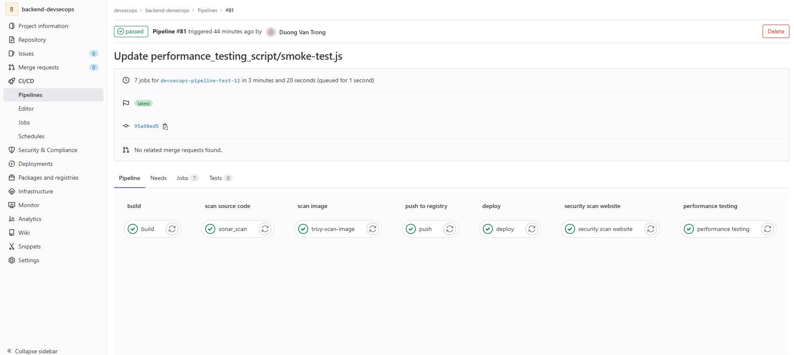
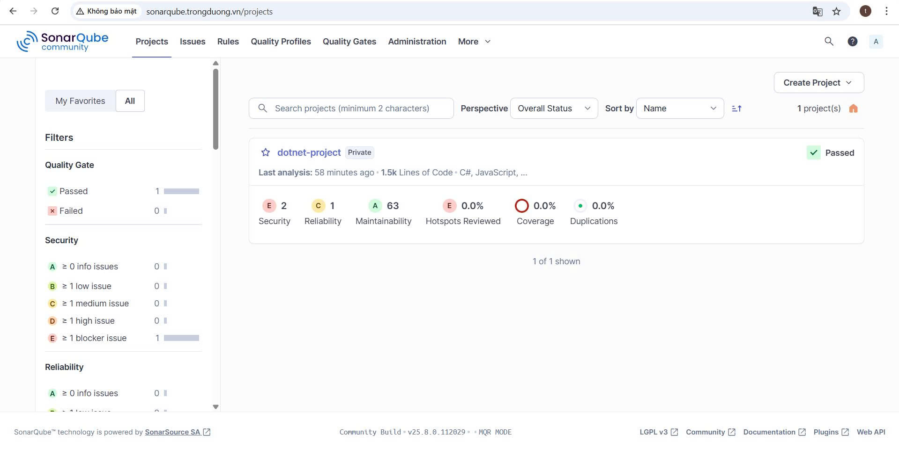
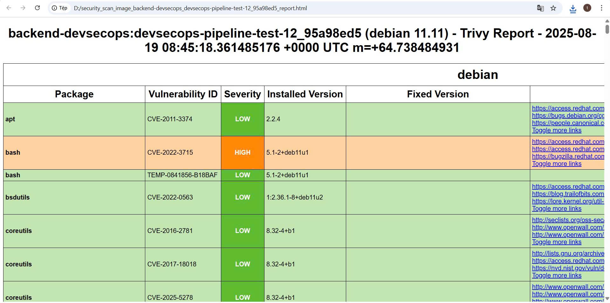
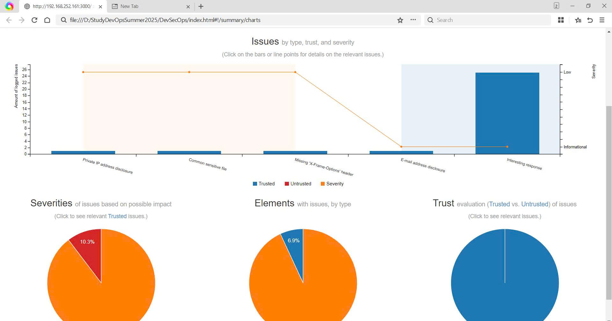
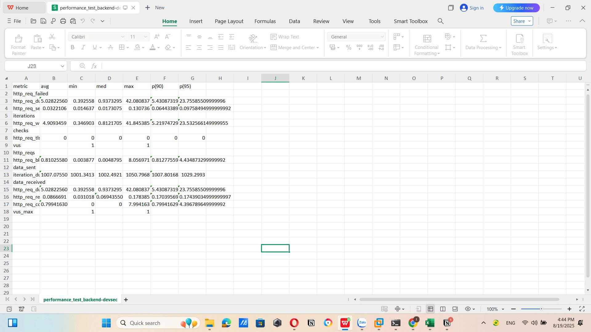

# Dự án Ecommerce

- **Back End**: .NET  
- **Front End**: ReactJs  

Dự án tập trung vào quá trình pipeline **DevSecOps** sử dụng các công cụ như:  
VMWare, EC2, GitLab, GitLab-CI, Harbor, SonarQube, Trivy, Arachni, K6.  
Sử dụng **Docker** để triển khai dự án.

---

## Pipeline DevSecOps

Pipeline bao gồm **7 quy trình**:

1. **Build**  
   - Sử dụng GitLab Runner để chạy CICD với executor là shell  
   - Clone code trên server rồi build  

2. **Scan source code**  
   - Sử dụng SonarQube Scanner để scan code  
   - SonarQube Server để nhận kết quả, quality gate mặc định  
   

3. **Scan image**  
   - Sử dụng Trivy để scan image  
   - Lưu artifacts là file HTML  
   

4. **Push to private Registry**  
   - Cài đặt Harbor trên EC2, thêm cert bằng certbot  
   - Tạo các project riêng cho dự án và lưu các image  
   

5. **Deploy**  
   - Pull image trên Harbor và run container  

6. **Security Scan Website**  
   - Sử dụng Arachni (cài đặt bằng Docker, dễ tích hợp vào pipeline)  
   

7. **Performance testing**  
   - Sử dụng K6 và viết các file `.js` để giả lập lưu lượng truy cập  
   - Artifacts là file CSV  
   
